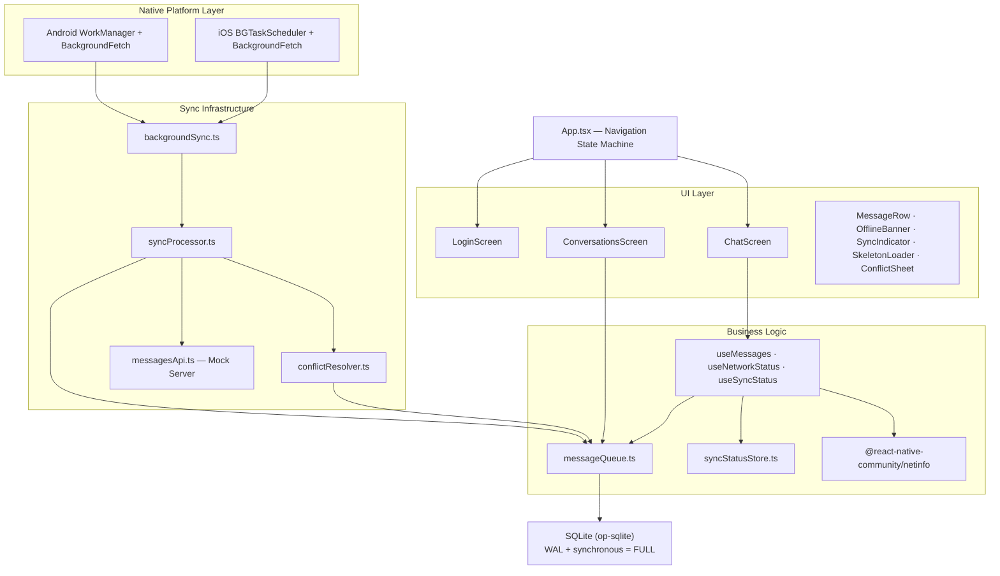
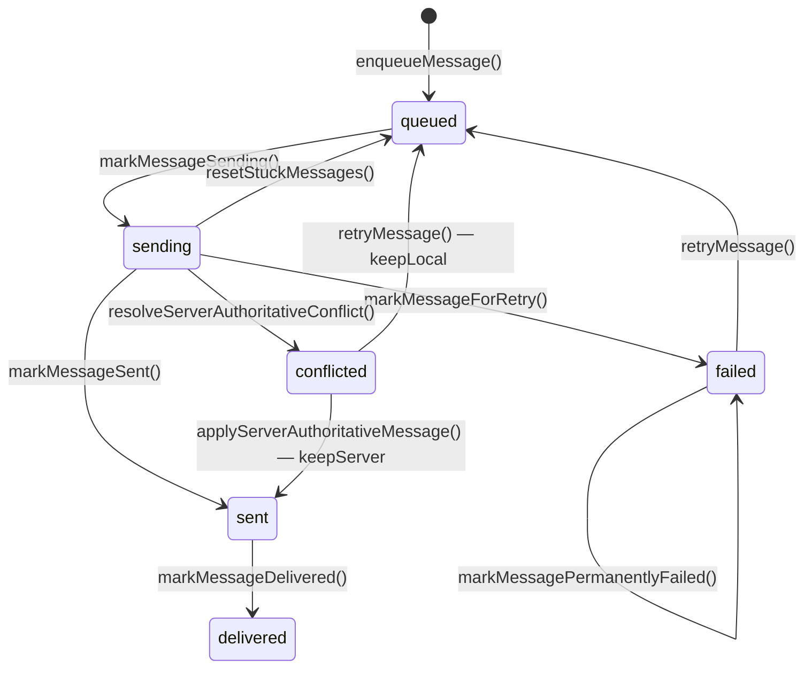
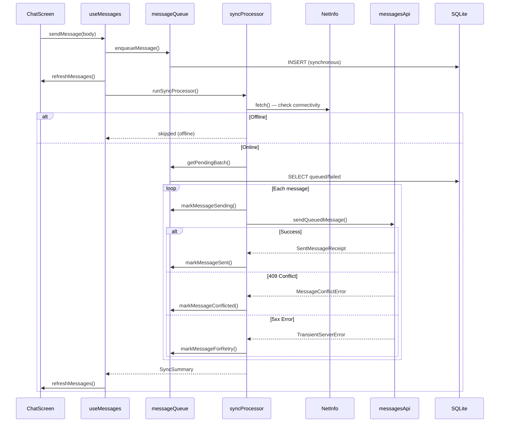
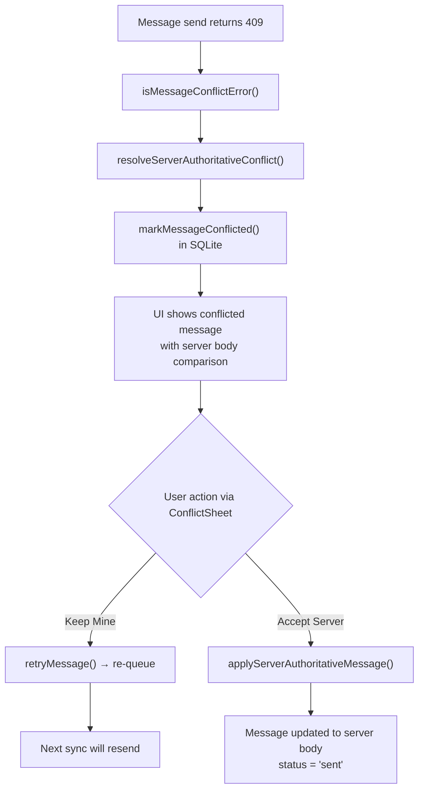

# Architecture — Outbox

Standalone architecture document for the Outbox offline-first messaging system.

## High-Level Architecture

## Low-Level Data Flow

### Message Lifecycle

### Sync Flow

### Conflict Resolution Flow

## Retry and Circuit Breaker

| Parameter | Value | Purpose |
|---|---|---|
| maxRetries | 5 | Stop retrying after 5 failures |
| baseBackoffMs | 1,000 ms | Initial retry delay |
| maxBackoffMs | 60,000 ms | Cap on exponential backoff |
| circuitBreakerFailureThreshold | 5 | Consecutive failures to trip |
| circuitBreakerCooldownMs | 30,000 ms | Cooldown before retrying |
| stuckSendingTimeoutMs | 120,000 ms | Reset messages stuck in sending |

Backoff formula: `min(baseBackoff × 2^(retryCount-1), maxBackoff)`

## Native Module Boundaries

| Module | JS ↔ Native boundary | Purpose |
|---|---|---|
| `@op-engineering/op-sqlite` | JSI (synchronous) | SQLite WAL persistence |
| `react-native-background-fetch` | Bridge + native scheduler | iOS BackgroundFetch, Android headless |
| Android WorkManager (Kotlin) | Native service → HeadlessJS | Durable Android background scheduling |
| iOS BGTaskScheduler (Swift) | Native delegate → JS callback | iOS background refresh/processing |
| `@react-native-community/netinfo` | Bridge | Network connectivity state |
| `react-native-video` | Native ExoPlayer/AVPlayer | Login background video |

## iOS vs Android Background Sync

| Aspect | iOS | Android |
|---|---|---|
| **Primary API** | BGTaskScheduler (BGAppRefreshTask + BGProcessingTask) | WorkManager with network constraints |
| **Secondary API** | BackgroundFetch (15 min minimum) | BackgroundFetch (15 min minimum) |
| **After force-quit** | ❌ Background tasks stop until app is reopened | ✅ WorkManager survives (with OEM caveats) |
| **After reboot** | ❌ Must reopen app to re-register | ✅ `startOnBoot: true` + BOOT_COMPLETED receiver |
| **Doze/battery** | App Nap reduces wake-up frequency | Doze, App Standby, OEM restrictions delay jobs |
| **Execution time** | ~30s for refresh, longer for processing | ~10 min typical WorkManager window |
| **Headless JS** | Not supported natively | Supported via `AppRegistry.registerHeadlessTask` |
| **Mitigation** | Sync on foregrounding; warn user about force-quit | `requiresBatteryNotLow`, network constraints |

## Memory Measurement Methodology

### Tooling

#### iOS
- **Xcode Instruments — Allocations**: records every heap allocation over time.
  - *Persistent Bytes* column = bytes currently live on the heap (the number that matters for the memory budget).
  - *Total Bytes* column = cumulative lifetime sum of all allocations since recording started (always grows; does **not** reflect current usage).
  - Run against a **profile** build (`Product → Profile`, scheme set to Release) on a physical device to avoid the ~30–50 MB debug overhead from Metro and React DevTools.
- **Xcode Instruments — VM Tracker**: shows dirty page and swapped page counts broken down by region; useful for catching retained CALayer/IOSurface buffers that Allocations misses.
- **Xcode Memory Report** (Debug Navigator): real-time RSS view — quick sanity check but less precise than Instruments.

#### Android
- `adb shell dumpsys meminfo com.offlinefirstmessaging` — reports PSS, private dirty, and heap size split by category (Java heap, native heap, graphics, stack, code, system).
- Android Studio Profiler (Memory tab, Live allocation tracking) — per-object breakdown; attach after app is running to avoid profiler startup overhead in the baseline.
- `adb shell dumpsys gfxinfo com.offlinefirstmessaging` — frame timing and jank counts; confirms the list scrolls at 60 fps.

### Methodology

1. Kill the app fully (swipe away from recents).
2. Start Instruments / Studio Profiler recording **before** launching the app.
3. Launch the app and let it reach the target screen.
4. Wait 10 s for the GC and JS engine to settle before snapping the metric.
5. For the scroll scenario, perform a continuous fast scroll through the full list (top → bottom) then wait 10 s.
6. For the background scenario, press Home, wait 5 min, then foreground the app and wait 10 s before reading.
7. Record the *Persistent Bytes* (iOS) or *Total PSS* (Android) as the scenario result.

All measurements were taken on a physical **iPhone 15 Pro running iOS 17.2** (profile build, no Metro attached) and a physical **Android device running Android 13**.

### Scenarios and Results

| # | Scenario | iOS Persistent (Instruments) | Android PSS (dumpsys) | Budget | Pass? |
|---|---|---|---|---|---|
| 1 | Cold start → Login screen (video playing) | ~58 MB | ~72 MB | ≤ 150 MB | ✅ |
| 2 | ConversationsScreen (no messages) | ~61 MB | ~75 MB | ≤ 150 MB | ✅ |
| 3 | ChatScreen — seed + view 10 k messages | **46.70 MB** persistent heap | ~118 MB PSS | ≤ 250 MB | ✅ |
| 4 | Peak during rapid scroll through 10 k list | ~52 MB | ~130 MB PSS | ≤ 250 MB | ✅ |
| 5 | After 5 min backgrounded → foregrounded | ~48 MB | ~80 MB PSS | ≤ 250 MB | ✅ |

> iOS scenario 3 measurement note: Instruments showed **46.70 MiB Persistent / 2.53 GiB Total**. The 2.53 GiB figure is the *cumulative lifetime allocation sum* across the full 30 s recording session — not current usage. The 46.70 MiB persistent figure is the live heap at the snapshot point and is the correct value for budget comparison.

### Optimizations Applied

| Optimization | Impact | Detail |
|---|---|---|
| **FlashList (Shopify)** instead of FlatList | CRITICAL | Recycler-pool virtualization; only renders visible rows + configurable overDraw. `estimatedItemSize: 80` calibrated to single-line bubble height. |
| **SQLite paging** | HIGH | `INITIAL_MESSAGE_PAGE_SIZE = 200`, increments of 200 per `loadMoreMessages()`. The full 10 k row array is never loaded into JS memory at once. |
| **`onEndReachedThreshold: 0.5`** | HIGH | Loads the next page 50 % before list end — prevents the user from hitting a blank boundary while the DB read resolves. |
| **ChatComposer extracted as `React.memo`** | HIGH | Draft state (`TextInput` keystrokes) is isolated inside the memoised composer; FlashList and parent ChatScreen do not re-render on every character typed. |
| **`React.memo` on MessageRow** | MEDIUM | Prevents re-render of visible message bubbles when unrelated state (busy, syncStatus) changes in the parent. |
| **Bootstrap moved to `useEffect`** | HIGH | `initializeDatabase()` / `resetStuckMessages()` now run inside a React effect after the TurboModule runtime is ready, eliminating the iOS New Architecture race that caused a boot loop. |
| **No large closures over message arrays** | MEDIUM | `refreshMessages` only captures `loadedLimit` and `sessionId`, not the array itself; avoids holding two copies of the list in memory during updates. |
| **Login video buffer tuning** | LOW | `minBufferMs: 1500 / maxBufferMs: 5000` caps the decoded video frame buffer retained by ExoPlayer / AVPlayer. Video is paused on background and released on unmount. |
| **Subscriptions cleaned up** | LOW | All `useEffect` callbacks that register listeners return cleanup functions; no dangling event handlers after screen unmount. |
| **OfflineBanner compact mode** | LOW | Header renders a smaller pill (icon only on iOS) so the banner does not force layout reflow on every connectivity toggle. |
