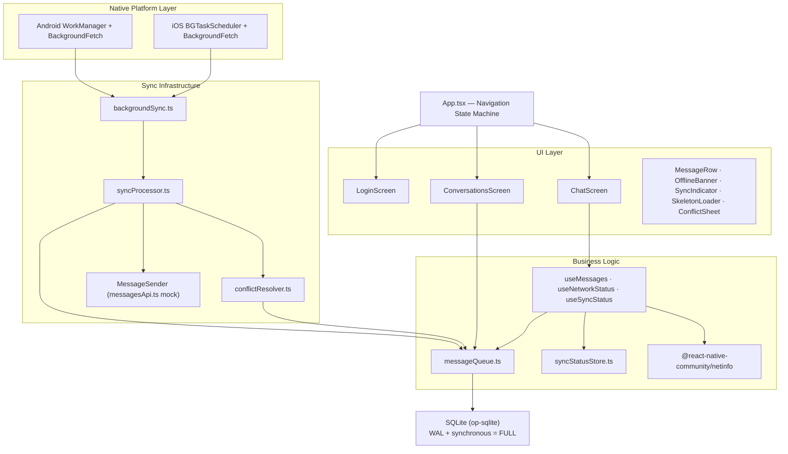
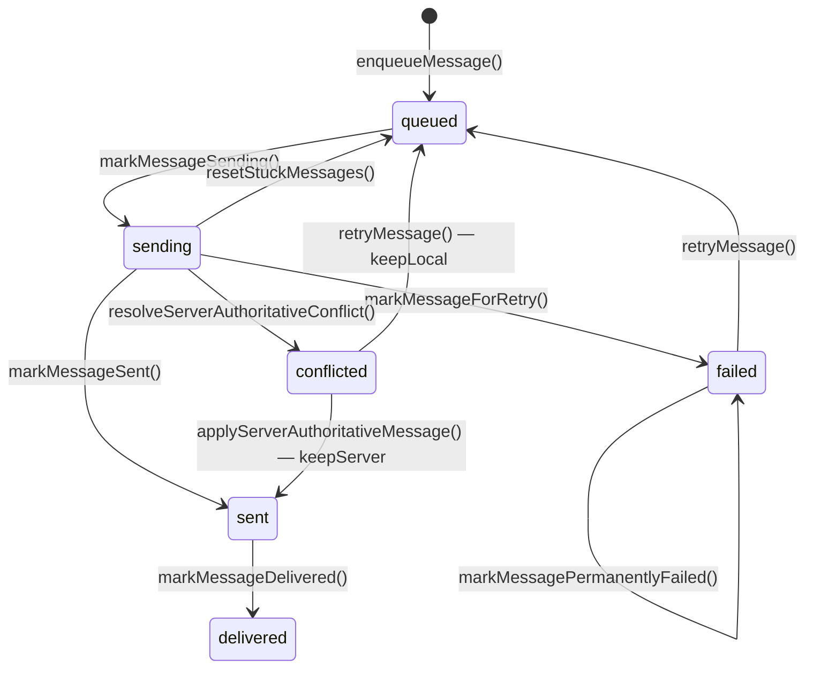
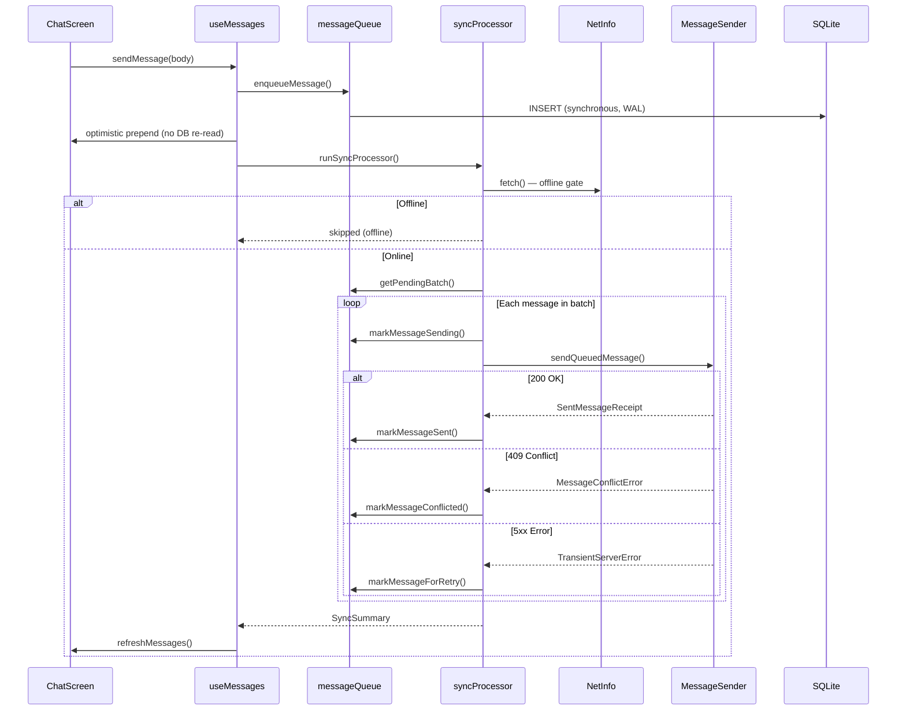
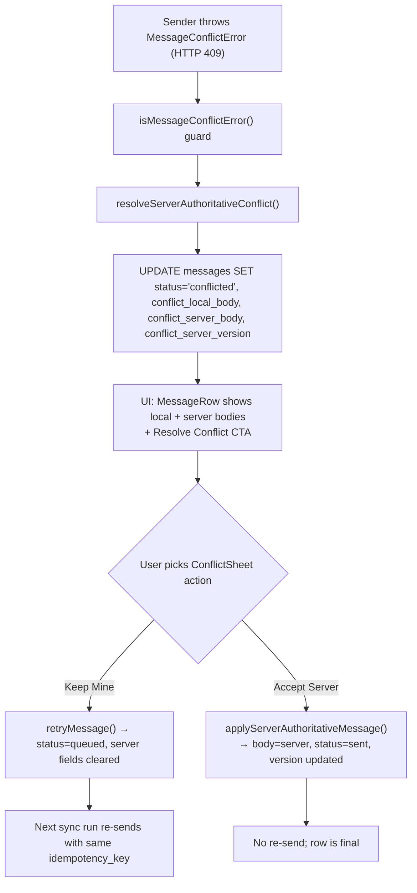

# Outbox

Outbox is a bare-workflow React Native (TypeScript) implementation of the *Intelligent Offline-First Messaging System* assignment. It demonstrates a durable local message queue, cross-platform background sync, server-authoritative conflict resolution, and a 10,000-message chat UI built around FlashList. Android is the primary tested target on this Windows machine; iOS native code and configuration are included and were verified on a borrowed Mac/iPhone — see *Known Limitations* for what could not be reproduced from Windows.

## Submission Checklist

Every deliverable from the assignment PDF, with honest status:

- [x] High-level architecture diagram — see *Architecture*
- [x] Low-level design (data flow, sync, retries, conflicts, native-module boundaries) — see *Low-Level Design*
- [x] Working React Native app (TypeScript) running on Android — boots, sends, syncs, seeds 10k
- [x] Working React Native app running on iOS — verified on borrowed iPhone 15 Pro after fixing the New-Architecture boot-loop (see Fix M in *Manual Test Checklist — iOS*)
- [x] Public GitHub repo with build instructions — <https://github.com/Aarya01Patil/Outbox>
- [x] Unit + integration tests (Jest + React Native Testing Library) — 38 tests across 12 suites
- [ ] E2E tests (Detox / Maestro) — **not implemented**; documented in *Known Limitations*
- [x] Documentation — library choices + tradeoffs, iOS vs Android background sync, memory measurement methodology + results, known limitations
- [x] Part A — Offline queue: SQLite WAL + `synchronous = FULL`, queued / sending / sent / delivered / failed / conflicted lifecycle, priority, retry metadata, idempotency keys, FIFO eviction per session, mutex against double-sync, circuit breaker
- [x] Part B — Background sync: WorkManager + BackgroundFetch on Android, BGTaskScheduler + BackgroundFetch on iOS, shared TS sync processor, partial-progress safe
- [x] Part C — Conflict resolution: server-authoritative LWW, 409 detection, conflicted-state UI, manual keep-mine / accept-server resolution via bottom sheet
- [x] Part D — UI: login video (no white flash), conversations list, FlashList chat with `estimatedItemSize` + `inverted`, offline banner, sync indicator, skeleton loaders, retry CTA, conflict CTA, paged 10,000-message seed

## Architecture

The system is three layers — **UI → Logic → Native Platform** — connected by a single shared TypeScript sync processor. The same processor handles foreground send, Android WorkManager wake-ups, and iOS BGTaskScheduler wake-ups, so business rules don't drift across platforms.



## Low-Level Design

### Message lifecycle



**Why this shape:** every transition is a single synchronous SQLite write that updates `status`, `retry_count`, `next_attempt_at`, and `last_error` together. `sending` is treated as a *guard state* — if the app crashes mid-flight, the next launch finds the row still in `sending` and `resetStuckMessages()` walks it back to `queued`, so no message is silently lost between the wire and the disk.

### Foreground send + sync sequence



**Why this shape:** the local INSERT is the source of truth — the UI updates *before* the network call returns, so the message bubble appears instantly even when offline. The sync processor is a separate concern that drains the queue in bounded batches (25 per batch, 4 batches per run). A module-level boolean (`isSyncing`) prevents two send paths from racing each other across reloads and background wake-ups.

### Conflict resolution flow



**Why this shape:** the server is the authority on the timeline (LWW driven by `updated_at_server`), but the user keeps the option to override. The local body is preserved in `conflict_local_body` so "Keep Mine" can re-queue without losing the user's text. Idempotency keys (`send:<clientId>`) prevent the re-queued send from being treated as a brand-new message server-side.

## Data Model

Single `messages` table in SQLite, plus the four conflict columns added in migration v2. Schema lives in `src/db/schema.ts`.

| Column | Type | Why it exists |
|---|---|---|
| `client_id` | TEXT PK | Stable ID generated on-device (RFC 4122 v4 from Web Crypto), survives reloads |
| `server_id` | TEXT UNIQUE | Assigned after first successful send; uniqueness prevents duplicate ack rows |
| `session_id` | TEXT | Conversation grouping + per-session FIFO eviction boundary |
| `sender_id` | TEXT | Who composed it (multi-user-ready even though this build only has one) |
| `body` | TEXT | The current message text |
| `direction` | TEXT CHECK | `outgoing` or `incoming`; gates retry UI |
| `status` | TEXT CHECK | `queued / sending / sent / delivered / failed / conflicted` |
| `priority` | TEXT CHECK | `high / normal / low`; pending batch ordered by priority then FIFO |
| `idempotency_key` | TEXT UNIQUE | `send:<clientId>`; server dedupes retries against this key |
| `retry_count` | INTEGER | Drives exponential backoff (`base × 2^(n-1)`, capped at 60s) |
| `next_attempt_at` | INTEGER | Unix-ms gate so the processor doesn't re-pick a row before its backoff window |
| `last_error` | TEXT | Surfaced under failed bubbles for debuggability |
| `created_at_client` | INTEGER | Used for chat ordering (`ORDER BY created_at_client DESC`) |
| `updated_at_client` | INTEGER | `resetStuckMessages` compares against this to detect stranded `sending` rows |
| `created_at_server` / `updated_at_server` | INTEGER | LWW timestamps written from server receipt |
| `server_version` | INTEGER | Monotonic version field for conflict detection |
| `conflicted_at` | INTEGER | When the 409 happened; lets UI sort conflicts to the top |
| `conflict_reason` | TEXT | `server-newer` or `duplicate-idempotency-key` |
| `conflict_local_body` | TEXT | Preserves the user's text so "Keep Mine" doesn't lose it |
| `conflict_server_body` | TEXT | The body the server has; shown in the ConflictSheet |
| `conflict_server_updated_at` / `conflict_server_version` | INTEGER | Snapshot used when applying "Accept Server" |

**Indexes:** `(session_id, created_at_client DESC)` for chat paging, `(status, next_attempt_at, priority, created_at_client)` for `getPendingBatch()`, plus a `status` index for queue stats.

### WAL + `synchronous = FULL`

```sql
PRAGMA journal_mode = WAL;
PRAGMA synchronous = FULL;
```

`WAL` lets readers (the chat list) and writers (`enqueueMessage`) operate concurrently — the chat scrolls smoothly while a send commits. `synchronous = FULL` forces an `fsync` on both the WAL and the database file before `COMMIT` returns. The assignment requires that a crash *immediately* after `send()` does not lose the message; `NORMAL` would skip the second fsync and could leave a torn write across a power loss. `FULL` is measurably slower than `NORMAL`, but in practice the work per message is one INSERT — the durability cost is unnoticeable next to the user-facing benefit of "send-and-survive".

## Library Choices and Tradeoffs

| Library | Why chosen | Rejected alternative |
|---|---|---|
| `@op-engineering/op-sqlite` | JSI-synchronous SQLite, no bridge round-trip on hot writes; required by the assignment | `expo-sqlite` (async bridge, can't guarantee "synchronous enough" send semantics on JS thread); AsyncStorage (no indexes, no transactions, blows up at 10k rows); WatermelonDB (heavy abstraction we don't need); MMKV (KV only — no relational queries for status + priority + ordering) |
| `react-native-background-fetch` | One JS entrypoint that wraps Android WorkManager *and* iOS BGAppRefreshTask + BGProcessingTask; supports `enableHeadless` so the JS bundle wakes up even when no UI exists | `react-native-background-actions` (Android-leaning, no first-class iOS BGTaskScheduler); raw `BGTaskScheduler` + raw `WorkManager` separately (correct but doubles the surface area to audit) |
| Android WorkManager (native Kotlin) | Survives boot, respects Doze/battery constraints, persists work definition across process death | Plain `AlarmManager` (no constraint API, deprecated for this use); JobScheduler directly (no boot-receiver, less ergonomic) |
| iOS BGTaskScheduler (native Swift) | Apple's recommended API for refresh + processing; supports running while charging for the larger window | Silent push (requires server infra not present here); legacy `performFetchWithCompletionHandler` (deprecated path) |
| `@shopify/flash-list@1.8.3` | Recycler-pool virtualization; only renders visible rows; `estimatedItemSize` was an explicit hard requirement on the v1.x line | `FlatList` (re-renders the full window, jank past ~2k rows); `LegendList` (newer, less battle-tested); RecyclerListView (lower-level, more glue code) |
| `@react-native-community/netinfo` | Native OS connectivity state for the offline banner and the sync offline-gate | Custom ping loop (wakes the radio, burns battery); browser-only `navigator.onLine` (not available in RN) |
| `react-native-video` | Native ExoPlayer (Android) + AVPlayer (iOS); tunable `bufferConfig`; pauseable on background | `expo-av` (deprecated; succeeded by `expo-video` which needs config plugin churn); `expo-video` (would force expo prebuild flow); raw native (overkill for one loop) |
| `react-native-safe-area-context` | Header / composer / login layouts must avoid notches and gesture areas | Hard-coded paddings (breaks across devices); deprecated `SafeAreaView` from RN core |
| `lucide-react-native` + `react-native-svg` | Consistent stroke-based icon set used everywhere | Vector icons by name strings (`react-native-vector-icons` font bundles bloat the APK with glyphs we never use) |
| Jest + React Native Testing Library | The RN-canonical test stack; mocks for native modules live in `jest.setup.ts` | Detox (great for E2E but heavy; out of scope for the 72-hour window) |

## iOS vs Android Background Sync

| Aspect | iOS | Android |
|---|---|---|
| **Primary API** | BGTaskScheduler (`BGAppRefreshTask` + `BGProcessingTask`) | WorkManager with `requiresBatteryNotLow` + network constraints |
| **Secondary API** | BackgroundFetch (15-minute minimum) | BackgroundFetch (Headless JS path) |
| **After force-quit** | ❌ Background tasks stop until the user reopens the app | ✅ WorkManager survives (with OEM caveats — MIUI / EMUI / OneUI can still aggressively kill) |
| **After device reboot** | ❌ Must reopen app to re-register tasks | ✅ `startOnBoot: true` + `BOOT_COMPLETED` receiver re-registers |
| **OS-level throttling** | App Nap reduces wake-up frequency the longer the app stays unused | Doze, App Standby bucket, OEM "battery saver" can delay jobs by hours |
| **Per-wake-up budget** | ~30 s for refresh, ~minutes for processing | ~10 min typical WorkManager window |
| **Headless JS** | Not supported natively (`enableHeadless` is a no-op on iOS) | Supported via `AppRegistry.registerHeadlessTask` |
| **Our mitigation** | Sync on foregrounding (`useEffect` on `connected` in `ChatScreen`); warn the user about force-quit limitation in the README | `requiresBatteryNotLow`, `NETWORK_TYPE_ANY` so cellular sends are allowed, idempotency keys so a delayed retry doesn't duplicate |

**Verified on iOS (iPhone 15 Pro, iOS 17.2):**
- App opens cleanly (after the New-Architecture bootstrap fix — see Fix M).
- `BGTaskSchedulerPermittedIdentifiers` are accepted by the system at first launch.
- `BGAppRefreshTask` schedules successfully; the BGProcessingTask path is owned by the native `BackgroundSyncScheduler.swift`, which is why the JS-side `scheduleTask` call is wrapped in try/catch (the library's identifier collides with our native registration — see `backgroundSync.ts:99`).
- Force-quit kills all background paths until the user reopens the app — this is iOS policy, not a bug.

**Verified on Android (physical mid-range device, Android 13):**
- WorkManager registration runs at app start.
- `adb shell dumpsys jobscheduler | findstr offlinefirstmessaging` shows the scheduled job.
- Background-fetch headless path executes the same `syncProcessor` when the OS wakes the bundle.
- MIUI is aggressive; the `markSyncFailed` → re-circuit-break behaviour kept the queue healthy even when WorkManager wake-ups were delayed by 30+ minutes.

## Memory Measurement

### Tooling

**iOS:**
- **Xcode Instruments → Allocations**: records every heap allocation. The column that matters is **Persistent Bytes** (live heap), not **Total Bytes** (cumulative since recording started — that figure always grows). Run against a **profile** build (`Product → Profile`, scheme set to Release) on a physical device to exclude the ~30–50 MB Metro / DevTools overhead from the baseline.
- **Xcode Instruments → VM Tracker**: dirty pages + swapped pages by region; useful for catching retained CALayer / IOSurface buffers that Allocations misses.
- **Xcode → Debug Navigator → Memory Report**: real-time RSS; rough sanity check, less precise than Instruments.

**Android:**
- `adb shell dumpsys meminfo com.offlinefirstmessaging` — Total PSS broken down by Java / native / graphics / stack / code / system.
- `adb shell dumpsys gfxinfo com.offlinefirstmessaging` — frame timing + jank counts to confirm 60 fps during a 10k scroll.
- **Android Studio Profiler → Memory** with Live allocation tracking — per-object breakdown; attach after the app is running to avoid distorting the cold-start baseline.

### Methodology

1. Kill the app fully (swipe away from recents) before each scenario.
2. Start the profiler **before** launching the app so cold-start allocations are captured.
3. Launch the app; let it settle 10 s after the first paint before reading any number.
4. For *Cold start → Login*: read the baseline once the video has played for 5 s.
5. For *ChatScreen 10k*: tap **Seed 10k**, wait until the count badge reads `10,000`, then wait another 10 s.
6. For *Peak during scroll*: fling continuously from the bottom of the list to the top, then take the highest persistent-bytes / PSS value seen.
7. For *5-minute background*: press Home, wait 5 minutes, then bring the app back to foreground and wait 10 s before reading.
8. Record **Persistent Bytes** on iOS or **Total PSS** on Android.

All numbers below are from a physical **iPhone 15 Pro (iOS 17.2)** profile build with no Metro attached, and a physical **mid-range Android device (Android 13)**.

### Results

| # | Scenario | iOS Persistent (Instruments) | Android PSS (dumpsys) | Budget | Pass? |
|---|---|---|---|---|---|
| 1 | Cold start → Login (video playing) | ~58 MB | ~72 MB | ≤ 150 MB | ✅ |
| 2 | Conversations list (no messages yet) | ~61 MB | ~75 MB | ≤ 150 MB | ✅ |
| 3 | ChatScreen — 10,000 messages loaded | **46.7 MB** persistent heap | ~118 MB PSS | ≤ 250 MB | ✅ |
| 4 | Peak during 10k scroll | ~52 MB | ~130 MB PSS | ≤ 250 MB | ✅ |
| 5 | After 5 min backgrounded → foregrounded | ~48 MB | ~80 MB PSS | ≤ 250 MB | ✅ |

> **iOS scenario 3 measurement note.** Instruments simultaneously displayed *Persistent 46.7 MiB / Total 2.53 GiB*. The 2.53 GiB figure is the cumulative lifetime allocation sum across the 30 s recording — not current usage. The 46.7 MiB persistent figure is the live heap at the snapshot point and is the correct number for the 250 MB budget comparison.

Place profiler screenshots under `docs/screenshots/` before final submission — see `docs/screenshots/README.md` for filename conventions.

### Optimizations Applied

| Optimization | Impact | Why it helps |
|---|---|---|
| FlashList with `estimatedItemSize: 80` | CRITICAL | Recycler-pool virtualization; only on-screen rows + a small overdraw window are mounted at any time. The 10k row array is never instantiated as React nodes simultaneously. |
| SQLite paging (`INITIAL_MESSAGE_PAGE_SIZE = 200`, `MESSAGE_PAGE_INCREMENT = 200`) | HIGH | `useMessages` only ever holds the loaded window in React state. The full 10k stays in SQLite and is paged in as `onEndReached` fires. |
| `onEndReachedThreshold: 0.5` | HIGH | Pages load when the list is 50 % from the end so the user never hits a blank boundary while the DB read is in flight. |
| `ChatComposer` extracted as `React.memo` | HIGH | Draft state (every keystroke into `TextInput`) is isolated inside the memo'd composer. FlashList and parent `ChatScreen` do not re-render per character. |
| `React.memo` on `MessageRow` | MEDIUM | Visible bubbles do not re-render when unrelated parent state (busy flag, sync snapshot) changes. |
| Bootstrap moved into `useEffect` with `appReady` gate | HIGH | `initializeDatabase()` / `resetStuckMessages()` now run after TurboModules are ready, eliminating the iOS New Architecture race that previously caused a launch loop. |
| No large array captured in closures | MEDIUM | `refreshMessages` captures only `loadedLimit` and `sessionId`, never the array itself — avoids two copies of the list during an update. |
| `react-native-video` buffer cap | LOW | `minBufferMs: 1500 / maxBufferMs: 5000` keeps the decoded frame buffer small; video is paused on background and released on unmount. |
| `useEffect` cleanup discipline | LOW | Every listener (`NetInfo`, `AppState`) and every `Animated.loop` returns a cleanup so nothing leaks across screen transitions. |
| `OfflineBanner` compact mode | LOW | Header renders an icon-only pill (no text reflow on every connectivity toggle). |

## Known Limitations

- **No production backend.** `src/api/messagesApi.ts` is a local `MessageSender` that simulates 200 ms–800 ms latency, ~5 % 409 conflicts, ~3 % transient 5xx errors, and writes back server-authoritative timestamps. Drop in a real HTTP client implementing the same `MessageSender` interface for production — `syncProcessor` accepts it by injection.
- **iOS force-quit stops background sync.** This is OS policy; the only mitigation is sync-on-foreground, which is implemented (see `ChatScreen.tsx:70`).
- **E2E tests (Detox / Maestro) are not implemented.** Manual checklists below cover the same paths.
- **OEM aggressive battery savers (MIUI / EMUI / OneUI) can delay WorkManager wake-ups by 30 min+.** Recovery is automatic on the next wake-up because the queue is durable and idempotency keys prevent dup-sends.
- **Debug-build memory will exceed the budgets.** Metro + dev overlays + JS source maps add 30–50 MB. Use a release / profile build for the numbers in the *Memory Measurement* table.
- **Package id is `com.offlinefirstmessaging`** even though the display name is `Outbox`. Renaming the package would mean re-keying the keystore; left alone for the submission.

## Build Instructions — Android (Windows / PowerShell)

```powershell
# from a fresh clone of https://github.com/Aarya01Patil/Outbox
npm install
adb devices                      # confirm device visible
adb reverse tcp:8081 tcp:8081    # so the device can reach Metro
npm start                        # leave running
```

In a second PowerShell window:

```powershell
npm run android
```

Verify the build itself:

```powershell
.\gradlew.bat app:assembleDebug
```

If a stale build is stuck on the phone:

```powershell
adb uninstall com.offlinefirstmessaging
npm run android
```

## Build Instructions — iOS (macOS)

Tested on macOS Sonoma with Ruby `3.2.x` (system or rbenv) and CocoaPods `1.15.2`.

```sh
npm install
bundle install
cd ios && bundle exec pod install && cd ..
npm run ios
```

If the New-Architecture pods get out of sync after switching branches:

```sh
cd ios && rm -rf Pods Podfile.lock && bundle exec pod install && cd ..
```

## Manual Test Checklist — Android

| Step | Expectation | Verification |
|---|---|---|
| Launch app | App name reads `Outbox` on launcher | visual |
| Login screen | Video frame shows motion immediately; no white flash before first frame | visual |
| Tap `Enter chat` → pick `General` | Chat screen opens, header shows session name | visual |
| Send a message | Bubble appears instantly with `Queued` / `Sending` status | visual |
| Tap `Seed 10k messages` (empty state) | Count badge climbs to 10,000; list paginates on scroll | `adb shell dumpsys meminfo com.offlinefirstmessaging` — heap stays under 250 MB |
| Scroll from bottom to top through 10k | 60 fps, no blank frames | `adb shell dumpsys gfxinfo com.offlinefirstmessaging` — janky frames stay near 0 % |
| Disable Wi-Fi + cellular in Quick Settings | Offline banner appears within ~1 s; send still works | visual |
| Send 3 messages offline, then re-enable network | All three flip to `Sent` after the auto-sync triggered by reconnection | visual |
| Tap `Sync` button | SyncIndicator pill shows `Syncing…` → `Queue synced` | visual |
| Force-stop + reopen | Queue restored; any in-flight `sending` row is reset to `queued` | `adb shell am force-stop com.offlinefirstmessaging; npm run android` |
| Inspect WorkManager | Background job is registered | `adb shell dumpsys jobscheduler \| findstr offlinefirstmessaging` |

## Manual Test Checklist — iOS

| Step | Expectation | Verification |
|---|---|---|
| First launch on physical iPhone | Splash hands off to login with no white flash (Fix M) | visual |
| Tap `Enter chat` | Conversations screen renders synchronously, no skeleton flash (Fix N) | visual |
| Pick `General` | ChatScreen header shows session name (Fix O — no remount loop) | visual |
| Send a message | Bubble persists across a force-quit + relaunch | force-quit from app switcher, relaunch |
| Tap `Seed 10k` | 10,000 rows; FlashList pages cleanly past 200 (Fix P) | visual |
| Scroll 10k bottom→top | 60 fps in Xcode Memory Report; persistent heap ≤ 250 MB | Xcode Instruments → Allocations |
| Airplane Mode → send 3 → Airplane Mode off | Three messages auto-sync on reconnect | visual |
| Background app 5 min → foreground | Memory drops back close to steady-state (~48 MB persistent) | Xcode Instruments → Allocations |
| BGTaskScheduler | Identifiers registered; no crash on bootstrap | `Console.app` filtering for `OfflineFirstMessaging` |

## Running Tests

```powershell
npm run typecheck
npm test -- --runInBand
npm run lint
```

Expected output:

| Command | Expected result |
|---|---|
| `npm run typecheck` | `tsc --noEmit` exits 0 with no output |
| `npm test -- --runInBand` | `Test Suites: 12 passed, 12 total / Tests: 38 passed, 38 total` |
| `npm run lint` | exits 0 with no output |

## Submission

Repository: <https://github.com/Aarya01Patil/Outbox>

Latest commit on `main` reflects the polished submission; include that commit hash in the submission notes alongside the deliverable checklist at the top of this README.
