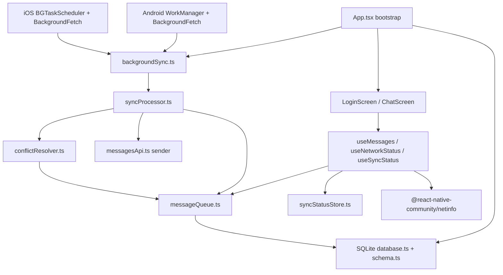

# Outbox

Outbox is a bare workflow React Native assignment project for an intelligent offline-first messaging system with durable local queueing, background sync infrastructure, conflict handling, and a mobile chat UI.

The Android target is the primary tested path on this Windows machine. iOS native files are implemented and ready for later validation on macOS with Xcode, but iOS build/runtime behavior cannot be honestly verified from Windows.

## Current Submission Status

| Area | Requirement | Reality in this repo |
| --- | --- | --- |
| Part A - Offline queue | Persist messages immediately, survive app kill/reboot, use SQLite WAL and `synchronous = FULL`, support queue statuses, retry metadata, priority, idempotency, mutex-protected sync. | Implemented in TypeScript with `@op-engineering/op-sqlite`. Queue-critical writes use synchronous SQLite calls. WAL and `FULL` durability pragmas are asserted at startup. Jest coverage exists for queue and sync behavior. |
| Part B - Background sync | Use `react-native-background-fetch`, Android WorkManager, iOS BGTaskScheduler, shared sync processor, safe `finish()` handling. | Implemented. Android WorkManager and BackgroundFetch are wired to shared sync paths. iOS `Info.plist`, `AppDelegate.swift`, and `BackgroundSyncScheduler.swift` are configured. iOS must still be verified on Mac/iPhone. |
| Part C - Conflict resolution | Server-authoritative timestamps, LWW where appropriate, HTTP 409 handling, mark conflicted messages, expose conflict metadata, manual retry. | Implemented in the queue and conflict resolver. Tests cover server-newer conflicts, local updates from server state, 409 conflict marking, and retry clearing conflict/failure state. A real backend is not included, so 409 behavior is verified through tests and typed sender errors. |
| Part D - UI / UX | Login video screen, chat screen with FlashList and `estimatedItemSize`, offline banner, sync indicator, skeleton loader, per-message retry/conflict states, 10,000-message path. | Implemented. Login uses `react-native-video` plus a visible animated handoff layer. Chat uses FlashList paging for 10,000 stored messages, stable keys, memoized rows, retry/conflict indicators, NetInfo, and safe-area-aware layout. |
| Production backend | Send/sync requests should eventually hit a server with idempotency and conflict responses. | Not included in the assignment repo. `src/api/messagesApi.ts` contains a local assignment sender that simulates successful server receipts. Replace this file with a real HTTP client for production. |

## Architecture



## File Map

| Path | Purpose |
| --- | --- |
| `App.tsx` | Initializes the database, asserts durability pragmas, resets stuck messages, registers background sync, and switches from login to chat. |
| `src/db/database.ts` | Opens the op-sqlite database and applies/asserts WAL plus synchronous durability settings. |
| `src/db/schema.ts` | Owns the SQLite schema for messages and sync metadata. |
| `src/queue/messageQueue.ts` | Synchronous queue persistence and lifecycle operations. |
| `src/queue/syncProcessor.ts` | Bounded sync loop with mutex, retry backoff, idempotent sending, circuit breaker, and conflict accounting. |
| `src/api/messagesApi.ts` | Assignment-local sender abstraction. Currently simulates server success receipts. |
| `src/sync/backgroundSync.ts` | JS background sync registration and shared task execution. |
| `src/sync/conflictResolver.ts` | Server-authoritative conflict handling and LWW helpers. |
| `src/sync/syncStatusStore.ts` | Small typed external store consumed by UI hooks. |
| `src/hooks/useMessages.ts` | Chat data loading, paged 10,000-message seed path, send, retry, and manual sync actions. |
| `src/hooks/useNetworkStatus.ts` | NetInfo wrapper for online/offline UI state. |
| `src/hooks/useSyncStatus.ts` | React hook over the typed sync status store. |
| `src/ui/screens/LoginScreen.tsx` | Video-backed login/entry screen with lifecycle-safe video pause and animated fallback layer. |
| `src/ui/screens/ChatScreen.tsx` | FlashList chat screen with composer, paging, offline banner, sync indicator, retry, and seed controls. |
| `src/ui/components/*` | Reusable message row, offline banner, sync indicator, and skeleton loader components. |
| `android/app/src/main/java/com/offlinefirstmessaging/sync/*` | Android WorkManager, boot receiver, scheduler, and headless sync service. |
| `ios/OfflineFirstMessaging/*` | iOS app delegate, background scheduler, plist, launch screen, and privacy metadata. |
| `__tests__/*` | Jest and React Native Testing Library coverage for queue, sync, conflicts, and UI. |

## Libraries Used and Why

| Library | Why it is used | Tradeoff |
| --- | --- | --- |
| `@op-engineering/op-sqlite` | Required by the assignment. Provides native SQLite access and synchronous writes for queue-critical persistence. | Native dependency. Android/iOS rebuild required. |
| `react-native-background-fetch` | Cross-platform JS background fetch entrypoint. All paths call the same sync processor. | OS scheduling is opportunistic. iOS stops background work after user force-quit. |
| Android WorkManager | Durable Android background scheduling with network/battery constraints and boot survival. | Native Kotlin code and manifest setup are required. Timing is still controlled by Android. |
| iOS BGTaskScheduler | Correct native API for refresh/processing tasks on iOS. | Must be verified on macOS/iPhone. Tasks do not run after user force-quit until the app is opened again. |
| `@shopify/flash-list@1.8.3` | Efficient chat list virtualization and assignment-required `estimatedItemSize`. | Extra list runtime dependency. |
| `@react-native-community/netinfo` | Native network state for offline banner and sync decisions. | Connectivity state can be indeterminate during startup. |
| `react-native-video` | Required login background video implementation using native video players. | Adds native decoder/buffer memory cost. |
| `react-native-safe-area-context` | Keeps login, chat header, and composer clear of notches and gesture areas. | Small native dependency. |
| `lucide-react-native` and `react-native-svg` | Consistent accessible icons for send, retry, sync, seed, and status UI. | Adds SVG rendering dependency. |
| Jest and React Native Testing Library | Unit and component behavior tests. | Tests mock native modules and do not replace real-device profiling. |

## Android Setup and Test Commands

Use these commands from PowerShell:

```powershell
cd "D:\Study\Extras\React Native Assignment"
npm install
adb devices
adb reverse tcp:8081 tcp:8081
npm start
```

Open a second PowerShell window:

```powershell
cd "D:\Study\Extras\React Native Assignment"
npm run android
```

If the old app build is stuck on the phone, reset it:

```powershell
adb uninstall com.offlinefirstmessaging
npm run android
```

## Manual Android Checklist

1. Launch the app. Expected: display name is `Outbox`.
2. Login screen. Expected: the media section shows visible motion, the `Enter chat` button is reachable, and there is no white flash before the poster/video appears.
3. Tap `Enter chat`. Expected: the chat screen opens.
4. Send a message. Expected: the message appears immediately because it is persisted locally before sync.
5. Tap `Seed 10k`. Expected: SQLite stores 10,000 messages and the header shows the stored count while only a page is loaded into React state.
6. Scroll upward through seeded messages. Expected: list stays usable because FlashList virtualizes rows.
7. Disable network from the phone settings. Expected: the offline banner changes to the offline queue state.
8. Send while offline. Expected: the message stays local and retry/sync state remains visible.
9. Re-enable network and tap `Sync`. Expected: queued work is processed by the shared sync processor.

Useful adb checks:

```powershell
adb logcat -c
adb shell am force-stop com.offlinefirstmessaging
adb shell monkey -p com.offlinefirstmessaging 1
adb logcat -d | findstr ReactNativeJS
adb shell dumpsys jobscheduler | findstr offlinefirstmessaging
adb shell dumpsys meminfo com.offlinefirstmessaging
adb shell dumpsys gfxinfo com.offlinefirstmessaging
```

## Local Verification

Run before submission:

```powershell
npm run typecheck
npm test -- --runInBand
npm run lint
.\gradlew.bat app:assembleDebug
```

Current expected result: all four commands pass on Windows.

## iOS Setup for Later Testing

Run these on a Mac with Xcode installed:

```sh
npm install
bundle install
cd ios
bundle exec pod install
cd ..
npm run ios
```

iOS background behavior to verify on device:

- App opens and registers BackgroundFetch without crashing.
- `BGTaskSchedulerPermittedIdentifiers` are accepted.
- `BGAppRefreshTask` and `BGProcessingTask` scheduling paths do not crash.
- Background work resumes only while iOS allows it. If the user force-quits the app, iOS will not run background fetch or BGTaskScheduler tasks until the user opens the app again.

## Memory and Performance Measurement

Assignment target budgets:

| Scenario | Target |
| --- | --- |
| Login video screen | 150 MB or lower |
| Chat with 10,000 messages | 250 MB or lower |

Measurement method:

1. Prefer release/profile builds for final numbers. Debug builds include Metro, dev overlay, extra checks, and larger memory use.
2. For Android, use Android Studio Profiler plus:

```powershell
adb shell dumpsys meminfo com.offlinefirstmessaging
adb shell dumpsys gfxinfo com.offlinefirstmessaging
```

3. Measure these states separately: cold start login, chat after first render, chat after seeding 10,000 messages, after scrolling, and after backgrounding for 5 minutes.
4. For iOS, use Xcode Instruments on a physical iPhone later.

## Known Limitations

- There is no production server in this repo. `messagesApi.ts` is a typed sender boundary with a simulated server receipt. Real network, auth, and API error handling should be plugged in there.
- Conflict behavior is implemented and tested, but real 409 responses require the real backend sender.
- iOS native background files are prepared but not yet built or device-tested because this machine is Windows.
- Background execution is not real-time on either OS. Android and iOS decide when background jobs actually run.
- Debug-build memory numbers may exceed assignment budgets. Use release/profile builds for final memory evidence.
- The package id remains `com.offlinefirstmessaging` even though the display name is `Outbox`.

## Submission Guidance

Submit the GitHub repository URL:

```text
https://github.com/Aarya01Patil/Outbox
```

Include the latest commit hash in your submission notes, plus this short reality statement:

```text
Outbox implements the offline queue, background sync infrastructure, conflict resolution, and React Native chat UI required by the assignment. Android has been built and tested from Windows. iOS native code and configuration are included for later Mac/iPhone verification. A real backend is not included; the server sender boundary is implemented with a simulated assignment sender and tests for conflict/error paths.
```
